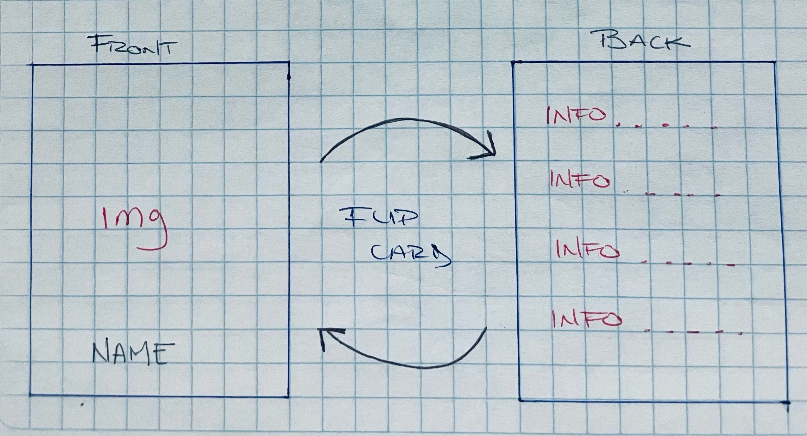
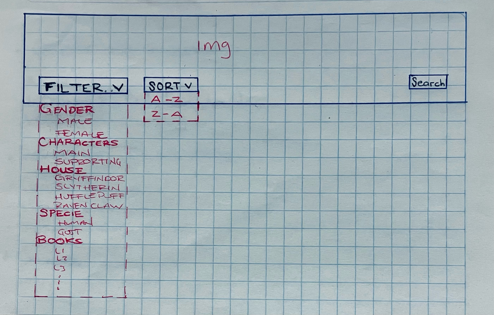
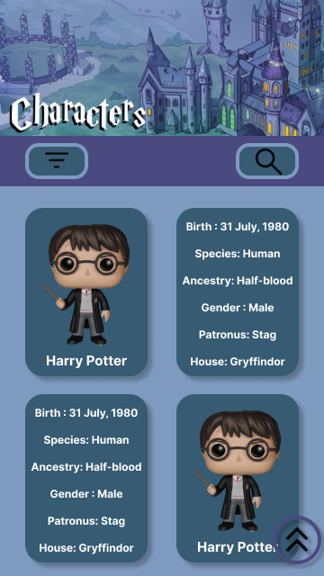
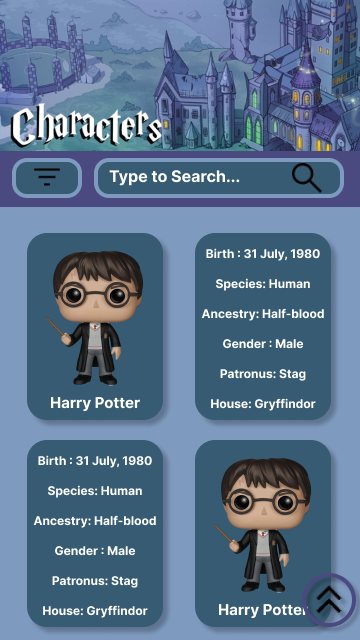

# Data Lovers

## Índice

* [1. Resumen del proyecto](#1-resumen-del-proyecto)
* [2. Data](#2-data)
* [3. Investigación de Usuarios](#3-investigación-de-Usuarios)
* [4. Historias de Usuario](#4-historias-de-usuario)
* [5. Diseño de la interfaz de Usuario](#5-diseño-de-la-interfaz-de-usuario)
* [6. Objetivos de aprendizaje](#6-objetivos-de-aprendizaje)

***
## 1. Resumen del proyecto

En este proyecto se diseñara una página web para visualizar un conjunto (set) de datos que se adecúe a lo que el usuario necesite.

El entregable final sera una página web que permita visualizar la data, filtrarla, ordenarla y buscarla por palabras clave.
## 2. Data

Harry Potter

Harry Potter es una serie de novelas fantásticas escrita por la autora británica J. K. Rowling, en la que se describen las aventuras del joven aprendiz de magia y hechicería Harry Potter y sus amigos durante los años que pasan en el Colegio Hogwarts de Magia y Hechicería. El argumento se centra en la lucha entre Harry Potter y el malvado mago lord Voldemort, quien asesinó a los padres de Harry en su afán de conquistar el mundo mágico.

Haciendo una investigación sobre la información que podrían necesitar nuestras usuarias encontramos que los datos de mayor interés son:

Información sobre los personajes como nombre, especie, género, fecha de nacimiento, saber si es muggle o conocer su casa de estudio.

El colegio Hogwarts de Magia y Hechicería utiliza el sistema de Casas. El cuerpo estudiantil de Hogwarts se divide en cuatro Casas ( Gryffindor, Hufflepuff, Ravenclaw y Slytherin;). 

## 3. Investigación de usuarios

* ¿Quiénes son los principales usuarios de producto?

    Personas de entre 15 – 40 años

* ¿Cuáles son los objetivos de estos usuarios en relación con el producto?

    Conocer información principal de HP

* ¿Cuáles son los datos más relevantes que quieren ver en la interfaz y por qué?

    Información de los personajes, ya que indica datos relevantes de cada personaje. 

* ¿Cuándo utilizan o utilizarían el producto?

  >* Cuando un usuario desconoce la saga y quiere familiarizarse.
  >* Cuando un usuario experto quiere verificar un dato en especifico de un personaje.

### 4. Historias de usuario

**HU1**

Yo como usuario [visitante del sitio] quiero visualizar todos lxs personajes de los libros para familiarizarme.

**Criterios de Aceptación HU1**

>* Todos los personajes/películas/deportistas aparecen en una misma vista, en forma
>de grilla (cuadrícula) sin ningún orden en particular.
>* La vista no tiene paginación, se hace scroll desde el primer elemento hasta el último.
>* Cada cuadrícula contiene:
>
>>* Nombre de personaje.
>>* Imagen.

**HU2**

Yo como usuario quiero poder filtrar y ordenar los personajes para ser mas especifica mi busqueda e identificar mejor los personajes.

**Criterios de Aceptación HU2**

>* El usuario puede filtrar personajes por genero, personajes, casas y libros.
>* El usuario puede ordenar de A – Z & Z-A.

**HU3**

Yo como usuario quiero poder buscar por nombre a los personajes para poder ser mas exacto en mi busqueda de un personaje.

**Criterios de Aceptación HU3**

>* El usuario puede buscar por palabras clave.

**Definición de Terminado.**

>* Todo el código está en la rama principal/main del repositorio.
>* La página está publicada en Github Pages y es accesible mediante un enlace/link/liga.
>* Cada estudiante del equipo ha hecho _code review_ del código escrito por la(s) otra persona(s).
>* Se hacen pruebas de usabilidad con al menos 2 usuarias y se incorporan las mejoras identificadas en la versión.

## 5. Diseño de la Interfaz de Usuario

#### 5.1 Prototipo de baja fidelidad

#### 5.2 Prototipo de alta fidelidad

## 6. Objetivos de aprendizaje

Reflexiona y luego marca los objetivos que has llegado a entender y aplicar en tu proyecto. Piensa en eso al decidir tu estrategia de trabajo.

### UX

- [ ] **Diseñar la aplicación pensando y entendiendo al usuario.**
- [ ] **Crear prototipos para obtener feedback e iterar.**
- [ ] **Aplicar los principios de diseño visual (contraste, alineación, jerarquía).**
- [ ] **Planear y ejecutar tests de usabilidad..**

### HTML Y CSS

- [ ] **Entender y reconocer por qué es importante el HTML semántico.**
- [ ] **Identificar y entender tipos de selectores en CSS.**
- [ ] **Entender como funciona flexbox y grill en CSS.**
- [ ] **Construir la aplicación respetando el diseño planeado (maquetación).**

### DOM

- [ ] **Entender y reconocer los selectores del DOM (getElement | querySelector).**
- [ ] **Manejar eventos del DOM. (addEventListener)**
- [ ] **Manipular dinámicamente el DOM. (createElement, appendchild, innerHTML, value)**

### JAVASCRIPT

- [ ] **Manipular arrays (filter|sort).**
- [ ] **Manipular objects (value).**
- [ ] **Entender el uso de bucles (forEach).**
- [ ] **Utilizar funciones (parámetros|argumentos|valor de retorno).**
- [ ] **Utilizar ES Modules (import|export).**

### PRUEBAS UNITARIAS (TESTING)

- [ ] **Testear funciones (funciones puras).**

### GIT & GITHUB

- [ ] **Ejecutar comandos de git (add|commit|pull|status|push).**
- [ ] **Utilizar los repositorios de GitHub (clone|fork|gh-pages).**
- [ ] **Colaborar en Github (pull requests).**

### BUENAS PRACTICAS DE DESARROLLO

- [ ] **Organizar y dividir el código en módulos (Modularización).**
- [ ] **Utilizar identificadores descriptivos (Nomenclatura | Semántica).**
- [ ] **Utilizar linter para seguir buenas prácticas (ESLINT).**